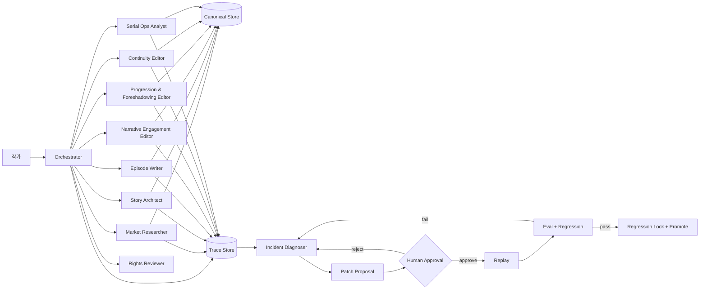

# Architecture: Web Novel Production Loop

## 1. 설계 목표

이 시스템은 웹소설 제작을 단발성 생성 작업이 아니라 **버전 관리되는 장기 운영 시스템**으로 취급한다. 최적화 대상은 한 회차의 문장 품질만이 아니라 다음 여섯 가지다.

1. 작품 정본의 일관성
2. 지속 가능한 연재 속도
3. 독자에게 약속한 반복 재미
4. 강약·감정·정보량의 정교한 제어
5. 캐릭터 관계와 독자 애착의 장기 유지
6. 직업·고유 영역·복선·시점·정보량의 장기 제어
7. 실패를 재발 방지 자산으로 바꾸는 운영 능력

## 2. 전체 구조



## 3. Canonical Store

### 정본 계층

- `Project Spec`: 목표, 독자, 플랫폼 가설, 일정, 작가 가용시간
- `Story Bible`: 세계 규칙, 캐릭터, 결말, 작품 약속
- `Narrative Control Map`: 강도 곡선, 감정 징검다리, 독자 공개 정보, 관계 앵커, 고위험 장치
- `Opening Contract`: 1화 각인·목적·전투/aftermath 기능·reader-known card
- `Protagonist Advantage Map`: 직업, 전이 전문성, 능력 시너지, 고유 영역의 경계와 비용
- `POV & Exposition Policy`: 주시점·전환 앵커·묘사 모드·설명 예산
- `Foreshadow Ledger`: seed·payoff·reminder·회수 상태
- `Long-form Phase Map & Scale Ladder`: 각인→성장→관계→스케일의 장기 단계
- `Episode Plan`: 화별 목표, 선택, 비용, 변화, 독백 기능, 설명 예산, 클리프행어
- `Published Ledger`: 실제 게시 버전과 독자에게 공개된 사실
- `Author Sustainability Profile`: 과부하 임계치, 감속 기준, 최소 소통 계획, 반응 확인 주기, 최소/권장/깊은 버퍼

### 버전 규칙

- 문장 수정: patch version
- 회차 구조·강도·관계 장면 변경: minor version
- 작품 약속·결말·핵심 설정·핵심 관계 보상 변경: major version + 작가 승인
- 게시된 사실을 되돌리는 retcon: major version + 독자 영향 분석
- 핵심 캐릭터 죽음·영구 이별: major version + 고위험 서사 게이트

## 4. 서사 제어면

### 4.1 강도 제어

각 회차는 `1~5`의 강도와 다음 모드 중 하나를 가진다.

- `setup`: 상황·목표·규칙 배치
- `pressure`: 장애와 비용 확대
- `payoff`: 축적된 기대 보상
- `recovery`: 감정 환기와 후속 정리
- `relationship`: 신뢰·갈등·진심 변화
- `transition`: 무대·목표·시즌 전환

기본 정책은 고강도 최대 2회 연속이며, 이후 3화 안에 recovery 또는 relationship 회차를 둔다. 낮은 강도는 무사건이 아니라 작은 목표·관계·정보 변화를 제공해야 한다.

### 4.2 감정 제어

감정 고점은 독자가 이미 본 징검다리를 근거로 한다.

```text
가치·신념의 행동 증명
-> 작은 손실 감수
-> 두려움·망설임 노출
-> 선택지 축소
-> 자발적 최종 선택
-> 감정 고점
```

작가만 아는 설정은 감정 근거로 계산하지 않는다. 하이라이트 내부의 장문 설명은 별도 실패 신호다.

### 4.3 독자 방향성

1화 종료 전 다음 정보가 확보되어야 한다.

- 주인공의 정체
- 현재 상황
- 당장 목적
- 목적의 개인적 이유
- 핵심 장애물
- 실패 비용

세계관 설명은 이 방향성을 보조해야 하며 대체할 수 없다.

### 4.4 독자-주인공 정렬

독백·대화는 `상황 정리 / 위험 평가 / 목표 / 선택 근거 / 타인 평가` 중 하나의 기능을 가진다. 독자가 주인공과 같은 판단을 해야 할 필요는 없지만, 왜 그렇게 판단했는지는 이해할 수 있어야 한다.

### 4.5 캐릭터·관계 제어

각 핵심 캐릭터는 다음 상태를 가진다.

- 욕망·결핍·상처·비밀
- 결점이 선택을 왜곡하는 방식
- 관계에 미치는 비용
- 취약성 공개 장면
- 핵심 관계의 거리·신뢰·공유 비밀·미해결 갈등
- 무대 이동 시 유지할 관계 앵커

### 4.6 개연성·주변 피해 제어

주인공의 선행·희생·구조·복수 장면은 원인, 대안, 책임 소재, 주변 피해, 피해 완화 노력, 후속 결과를 함께 기록한다. 선한 의도를 이유로 결과 책임을 삭제하지 않는다.

### 4.7 고위험 서사 장치

다음은 자동 적용하지 않는다.

- 핵심 보상 캐릭터의 죽음
- 메인 관계의 영구 단절
- 무대 이동 시 기존 관계 전면 삭제
- 주인공의 선행이 대규모 제3자 피해를 만드는 선택
- 독자에게 약속한 핵심 관계 보상의 철회

필수 조건은 대안 비교, 인물 서사 완결성, 관계 축적, 이후 정서 보상, 독자 약속 영향, 작가 승인이다.


### 4.8 1화 행동·전투 제어

1화의 행동 장면은 `combat / aftermath / problem-solving / dialogue / discovery`로 분류한다. combat이면 주인공 각인, 싸움의 목적, 승패 비용, 독자가 미리 아는 카드와 적의 정보 부족을 요구한다. 이 조건이 없으면 화려함과 무관하게 opening anchor failure다.

### 4.9 직업·고유 영역 제어

주인공의 이전 직업은 전이 가능한 전문성, 새 능력과의 시너지, 오판과 한계, 반복 증명 장면으로 연결한다. 고유 영역은 독점 접근과 반복 보상을 제공하되 비용·경계가 있어야 한다. 동일 능력의 무제한 확산은 unique-domain dilution로 분류한다.

### 4.10 시점·묘사·정보량 제어

프로젝트는 주시점과 장면 전환 앵커를 정본으로 갖는다. 평시는 직접 묘사로 명료성을 유지하고 절정은 제한적 간접 묘사를 허용한다. 정보 공개는 현재 선택·생존에 필요한 규칙을 우선하고 세계 규모 정보는 지연한다.

### 4.11 복선 기억 제어

복선은 Foreshadow Ledger에서 seed와 payoff를 추적한다. 5~8화 범위의 짧은 복선은 직접 회수할 수 있으나, 그보다 긴 복선은 회수 전에 핵심 기억을 재활성화하는 reminder가 필요하다.

### 4.12 장기 구간과 스케일 제어

1~5화 각인, 5~25화 성장 증명, 25~100화 관계 심화, 100화 이후 스케일 확장을 별도 목표로 관리한다. 스케일은 적의 능력치뿐 아니라 주인공이 만나는 인물의 권력, 접근 가능한 기관, 결정의 영향 범위가 상승해야 한다.

## 5. 상태 머신

```text
discovery
  -> market_research
  -> planning
  -> buffering
  -> ready_for_launch
  -> serializing
  -> paused | completed
```

허용되지 않는 전이 예:

- `planning -> serializing`: 20화 계획·강도 곡선·비축 게이트 우회
- `serializing -> planning`: 게시 이력을 무시한 정본 초기화
- `completed -> buffering`: 새 시즌/프로젝트 버전 없이 재개
- `critical author load -> ready_for_launch`: 지속 가능성 게이트 우회

## 6. 승인 게이트

| Gate | 승인 대상 | 자동 검사 | 사람 결정 |
|---|---|---|---|
| G0 | 목표·장르·독자·가용시간 | 필수 입력 | 우선순위 |
| G1 | Story Bible + 관계 지도 | 필드·ID·버전 | 콘셉트·결말·핵심 관계 |
| G2 | 20화 설계 + 강도 곡선 + Opening/Advantage/POV/Foreshadow | 회차 수·hook·전투 anchor·직업 증명·복선 reminder | 재미와 방향 |
| G3 | 출시 | 버퍼·메타데이터·IP·작가 부하·시점·정보량 | 최종 원고·게시 |
| G4 | 고위험 서사 장치 | 필수 근거·대체 보상 | 죽음·영구 이별·전면 관계 단절 |
| G5 | 계약·유료화 | 조항 추출·비교 | 서명·권리 양도 |

## 7. 제작 DAG

```text
Market Snapshot
-> Concept Card
-> Story Bible
-> Relationship Map
-> Narrative Control Map
-> Opening Contract + Protagonist Advantage Map
-> POV/Exposition Policy + Foreshadow Ledger + Scale Ladder
-> 20-Episode Map
-> Scene Cards
-> Drafts
-> Structural Edit
-> Narrative Engagement Audit
-> Line Edit
-> Continuity Audit
-> Launch Package
-> Serialization
```

각 노드는 입력 버전과 출력 해시를 기록한다. 선행 노드가 바뀌면 영향받는 하위 노드를 `stale`로 표시한다.

## 8. 역할별 책임

| 역할 | 핵심 책임 | 변경 권한 |
|---|---|---|
| Orchestrator | 상태·버전·게이트·작업 순서 | 승인된 병합만 |
| Story Architect | 상황·목적·결점·관계·강도 곡선·20화 구조 | 제안 |
| Episode Writer | 장면과 원고 초안 | 원고 초안만 |
| Narrative Engagement Editor | 감정 축적·독자 정렬·관계·개연성·고위험 장치 감사 | 수정 제안 |
| Progression & Foreshadowing Editor | 장기 구간·직업 시너지·고유 영역·복선·스케일 관리 | 수정 제안 |
| Continuity Editor | 정본·시간선·정보 공개·호칭·능력 일관성 | 수정 제안 |
| Serial Ops Analyst | 버퍼·지표·댓글·작가 지속 가능성 | 일정안 제안 |
| Incident Diagnoser | 실패 원인과 최소 패치 | 승인 전 적용 금지 |

Narrative Engagement Editor와 Continuity Editor를 분리하는 이유는 **설정상 맞는 장면도 감정적으로 설득력이 없을 수 있고, 감정적으로 강한 장면도 정본과 충돌할 수 있기 때문**이다.

### Agent registry and duplicate authority control

`config/agent_registry.json` is the canonical role registry for this package. It defines 13 roles and marks exactly one runtime routing owner: the Codex agent at `.codex/agents/webnovel-orchestrator.md`.

`prompts/orchestrator.md` is deliberately an adapter-only prompt for package export. It mirrors the runtime router's responsibilities but cannot become a second independent dispatcher. The registry audit fails if more than one role owns runtime routing or if the adapter rule is removed.

`config/agent_sample_evaluation_policy.json` defines sample-loop evaluation for roles 1-9. Role 10 and context-compounding roles 11-13 are excluded because their acceptance gates are rights, evidence provenance, state consistency, and human review recurrence rather than narrative sample scores.

### Context-compounding architecture

The package adds three specialist roles without creating another router: Context & Evidence Planner, Character State Keeper, and Review Diff Analyst. Story Architect still owns world canon, Continuity Editor audits it, and Incident Diagnoser owns root-cause analysis and minimum change proposals.

The Inner Loop creates schema-valid Context Plan and Evidence Pack artifacts before drafting. Canonical sources outrank retrieved summaries, unresolved required conflicts block work, structured roleplay is input rather than prose, and no more than two Writer candidates may be compared. Approved manuscripts produce a proposed Episode Memory Delta; state changes commit only after Continuity PASS and explicit author approval.

The Outer Loop accepts only explicit draft/final pairs. It classifies semantic changes using the fixed taxonomy in `context_compounding_policy.json`, requires at least three cause hypotheses, and proposes a system change only after the same classification recurs three times in the same scope among the latest ten completed reviews. One run emits at most three proposals.

The Control Loop never auto-promotes. A human-approved candidate must pass offline replay, run on exactly one canary task, and receive separate promotion approval. Any regression blocks promotion and selects the recorded previous version for rollback.

### Legacy data plane

The 1.14.0 data plane does not rewrite historical runs to mimic current execution. A generated migration index records the SHA-256, classification, authority, migration status, and permitted current use of every collected sample-loop artifact. Historical ledgers are episodic evidence, element packs and calibration reports are derived evidence, old rule packs are historical references, and project runners are tooling rather than instruction authority. This preserves auditability while preventing old task-local improvements from bypassing the current Review Diff and Control Loop.

Sample-loop evaluation is independent per source TXT. The four sample files are not merged into one composite target. Each sample runs its own parallel job:

```text
element extraction -> agent recreation -> original-reference evaluation excluding plagiarism checks -> queue improvement point -> close task
```

The original sample is the reference for structure, function, reader effect, and workflow compliance. Plagiarism/copy-overlap checks are excluded from this loop score.

Long source samples are tested as progressive 10-episode windows without creating a new global cycle. The first pass uses episodes 1-10. After that window is verified or explicitly blocked with evidence, the same cycle advances to 11-20, then 21-30, then later and back-half windows. `config/source_chunk_policy.json` defines this behavior and `templates/source_chunk_cycle.json` records each window.

Window state must carry forward:

- canon facts
- unresolved threads
- foreshadow seeds
- relationship changes
- progression changes
- open questions for the next window

This makes the workflow test early hook quality, mid-arc payoff, and later continuity/payoff behavior instead of optimizing only the opening slice.

System improvements are batched between tasks. A task records one scoped improvement point, then closes. The system update gate deduplicates by failure code, root cause, and affected agents, applies a small set of system changes, and verifies those changes on the next task. This prevents four parallel sample jobs from applying the same patch four times.

Every sample-loop evaluation should leave a per-sample record shaped like `templates/agent_sample_loop_evaluation.json`, including the sample id, original reference, extracted element pack, selected failure, minimal change, rerun result, and acceptance decision.

## 9. 운영 루프

### 정상 루프

```text
Plan -> Draft -> Narrative Audit -> Continuity Audit -> Approve -> Publish -> Observe -> Review -> Plan
```

### 자기수복 루프

```text
Failure detected
-> Trace bundle 생성
-> 원인 가설 3개 이상
-> 최소 책임 범위 선택
-> Patch proposal
-> 작가 승인
-> 원래 입력 Replay
-> 전체 Regression
-> Failure case 저장
-> 새 버전 승격
```

## 10. 실패 유형별 책임 범위

| 유형 | 주 책임 | 자동 수정 가능 | 승인 필요 |
|---|---|---:|---:|
| 누락 필드·번호 오류 | Validator | 예 | 아니오 |
| 정본 버전 불일치 | Orchestrator | 제한적 | 예 |
| 설정 충돌 | Continuity Editor | 제안만 | 예 |
| 약한 초반 방향성 | Story Architect | 대안 생성 | 예 |
| 강도 포화 | Narrative Engagement Editor | 재배치안 | 예 |
| 감정 징검다리 부족 | Narrative Engagement Editor | 장면안 | 예 |
| 독자-주인공 정렬 실패 | Episode Writer/Narrative Editor | 대안 생성 | 최종 원고 승인 |
| 주변 피해 무시 | Narrative Engagement Editor | 제안만 | 예 |
| 관계 단절 | Story Architect/Narrative Editor | 대안 생성 | 반드시 |
| 캐릭터 죽음 | Story Architect | 아니오 | 반드시 |
| 목적 없는 1화 전투 | Narrative Editor | 구조 대안 | 예 |
| 정보 과다 | Episode Writer/Narrative Editor | 분산안 | 최종 원고 승인 |
| 직업-능력 단절 | Story Architect/Progression Editor | 증명 장면안 | 예 |
| POV 전환 혼란 | Continuity Editor | 제한적 | 최종 원고 승인 |
| 복선 기억 단절 | Progression Editor | reminder 제안 | 예 |
| 고유 영역 희석 | Story Architect | 아니오 | 반드시 |
| 가짜 스케일업 | Progression Editor | ladder 재설계 | 예 |
| 반응 기반 정본 진동 | Orchestrator/Serial Ops | 아니오 | 반드시 |
| 문장 반복 | Episode Writer | 제한적 | 최종 원고 승인 |
| 버퍼 붕괴 | Serial Ops | 일정안 계산 | 예 |
| 작가 과부하·고립 | Serial Ops | 아니오 | 작가 결정 |
| 플랫폼 규칙 변경 | Market Researcher | 프로필 갱신 | 추천 승인 |
| 저작권·계약 위험 | Rights Reviewer | 아니오 | 반드시 |

## 11. 평가 계층

### L0 Schema

파일 형식, 필수 필드, ID, 상태 전이를 검사한다.

### L1 Canonical consistency

정본과 회차, 공개 정보, 시간선의 충돌을 검사한다.

### L2 Narrative orientation

주인공 상황·목적·장애물, 작품 약속, 인과성, 독자-주인공 정렬을 평가한다.

### L3 Emotional and relational quality

강약 대비, 감정 징검다리, 결점의 행동 영향, 관계 연속성, 죽음·이별 위험을 평가한다.

### L4 Operational quality

버퍼, 주기, 비용, 지연, 검토량, 작가 지속 가능성을 평가한다.

### L5 Business and rights

플랫폼 포장, 유료화 준비, 계약·권리 위험을 검토한다.

L2~L5는 확률적 평가이므로 단독으로 자동 승격하지 않는다.

## 12. 관측성 데이터 모델

각 span은 다음을 포함한다.

```json
{
  "trace_id": "tr_...",
  "span_id": "sp_...",
  "project_id": "novel_...",
  "project_version": "1.2.0",
  "story_bible_version": "1.1.0",
  "agent_role": "narrative_engagement_editor",
  "operation": "audit_emotional_peak",
  "input_hash": "sha256:...",
  "prompt_version": "narrative-editor@1.1.0",
  "model": "runtime-selected",
  "tools": [],
  "source_ids": [],
  "output_hash": "sha256:...",
  "evals": {
    "intensity_contrast": 4,
    "emotional_earn": 3,
    "reader_alignment": 4,
    "relationship_continuity": 5
  },
  "latency_ms": 0,
  "cost": 0,
  "status": "warning"
}
```

## 13. 최소 수정 원칙

진단 에이전트는 다음 순서로 책임 범위를 좁힌다.

1. 입력 또는 정본이 잘못됐는가
2. 독자가 알아야 할 정보가 공개되지 않았는가
3. 감정·관계 축적이 부족한가
4. 강도 배치가 포화됐는가
5. 검색·도구 결과가 잘못됐는가
6. 데이터가 단계 사이에서 유실됐는가
7. 스키마·검증이 없었는가
8. 프롬프트의 우선순위가 잘못됐는가
9. 모델 능력 또는 비결정성이 원인인가
10. 전체 workflow 재설계가 필요한가

모든 실패를 프롬프트 문구 문제나 자극 부족으로 환원하지 않는다.

## 14. 회귀 테스트 전략

### 사례 단위

- 실제 실패 입력
- 기대되는 필수 사실
- 포함되면 안 되는 오류
- 정본 버전
- 판정 방법
- 필수 오류 코드와 금지 오류 코드

### 테스트 종류

- schema test
- continuity test
- opening orientation test
- intensity contrast test
- emotional bridge test
- reader alignment test
- collateral responsibility test
- relationship anchor test
- character death approval test
- opening combat anchor test
- exposition budget test
- profession-ability synergy test
- POV anchor test
- foreshadow reminder test
- unique-domain boundary test
- scale-ladder progression test
- reaction-driven canon churn test
- author sustainability test
- hook promise test
- metadata test
- buffer state test
- rights stop test
- platform freshness test

### 승격 기준

- 원래 실패 사례 통과
- 기존 critical 회귀 100% 통과
- non-critical 회귀 설정 임계치 이상
- 3회 반복에서 일관된 결과
- 비용·지연 예산 이내
- 작가 승인

## 15. 운영상 핵심 리스크

- 모델 교체 시 문체와 평가 기준이 함께 변할 수 있음
- LLM judge가 생성 모델과 같은 약점을 공유할 수 있음
- 현재 랭킹을 과적합하면 작품 정체성이 흔들릴 수 있음
- 게시된 설정을 수정하면 기존 독자 경험과 충돌할 수 있음
- 댓글 중심 최적화는 침묵하는 독자를 놓칠 수 있음
- 강도를 올리는 수정은 단기 지표를 개선해도 장기 피로를 키울 수 있음
- 감정 장면의 설명 보강은 오히려 감정 강요를 만들 수 있음
- 무대 이동이 관계 단절로 이어지면 작품 정체성이 초기화될 수 있음
- 캐릭터 죽음은 단기 충격보다 장기 독자 보상 손실이 클 수 있음
- 작가의 과부하·고립은 품질 문제가 아니라 프로젝트 중단 위험임
- 1화 전투의 화려함이 캐릭터 각인 부족을 가릴 수 있음
- 직업과 고유 능력이 만능 해결책이 되면 갈등이 소멸할 수 있음
- 복선 리마인드가 길면 회수가 아니라 재설명이 될 수 있음
- 수치 인플레이션만으로 스케일업하면 관계와 사회적 성장이 체감되지 않음
- 단기 댓글에 반응해 정본을 자주 바꾸면 장기 구조가 붕괴함
- 계약 분석 결과를 법률 자문으로 오인할 수 있음

## 16. 배포 단위

개발 원본은 Markdown + JSON + scripts로 관리한다. 배포 시 `build_export.py`가 다음을 하나의 JSON으로 묶는다.

- metadata
- documentation
- skillMdBody
- scripts
- references

## 17. Manuscript Length Gate

Every episode manuscript must pass the mandatory length gate before candidate or final manuscript status. The gate removes Unicode whitespace and requires at least 3600 remaining characters per episode. `scripts/audit_episode_length.py` enforces this rule and reports `EPISODE_NONSPACE_UNDER_MINIMUM` as a blocking failure.

이 방식은 문서와 runtime 본문의 불일치, 이중 직렬화 수작업, 회귀 테스트 부재를 줄인다.
